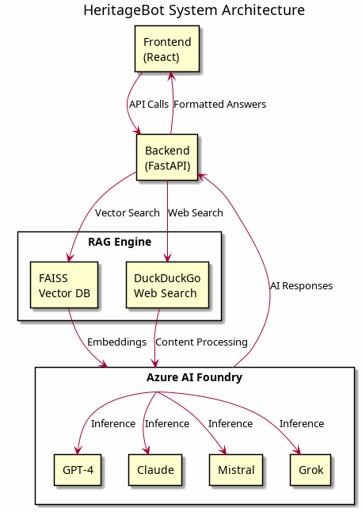

<p align="center">
  
</p>

<h1 align="center">HeritageBot</h1>

<p align="center">
  <strong>An AI-powered chatbot for exploring the rich heritage of Twinings, Ovaltine & Associated British Foods</strong>
</p>

<p align="center">
  <a href="#-features"></a>
  <a href="#-tech-stack"></a>
  <a href="#-getting-started"></a>
</p>

<p align="center">
  
  
  
  
  
  
</p>

---

## Overview

**HeritageBot** is a full-stack Retrieval-Augmented Generation (RAG) application that answers questions about the history and heritage of **Twinings Tea**, **Ovaltine**, and their parent company **Associated British Foods (ABF)**. 

The chatbot leverages multiple AI models deployed via **Azure AI Foundry**, combined with a **FAISS vector database** for semantic search over a curated knowledge base, and real-time web search for the latest information.

---

## Features

| Feature | Description |
|---------|-------------|
| Multi-Model Support | Switch between GPT-4o, Claude, Mistral, and Grok models |
| RAG Pipeline | Combines local vector search with live web search |
| Guardrails | Input/output filtering to ensure relevant responses |
| Conversation History | Persistent chat history stored in browser localStorage |
| Modern UI | Beautiful React interface with Tailwind CSS and Framer Motion animations |
| Responsive Design | Works seamlessly on desktop and mobile devices |
| Fast & Async | Fully asynchronous backend for optimal performance |

---

## Architecture

<p align="center">
  
</p>

---

## Tech Stack

### Backend
| Technology | Purpose |
|------------|---------|
| **Python 3.14+** | Runtime environment |
| **FastAPI** | High-performance async web framework |
| **LangChain** | LLM orchestration and RAG pipeline |
| **FAISS** | Vector similarity search database |
| **Azure AI Foundry** | Model deployment & inference |
| **uv** | Modern Python package manager |

### Frontend
| Technology | Purpose |
|------------|---------|
| **React 19** | UI component library |
| **Vite** | Lightning-fast build tool |
| **Tailwind CSS v4** | Utility-first styling |
| **Framer Motion** | Smooth animations |
| **Lucide React** | Beautiful icons |
| **bun** | Fast JavaScript package manager |

### AI Models (via Azure AI Foundry)
- **GPT-4o** - OpenAI's latest model
- **Claude** - Anthropic's assistant
- **Mistral** - Open-source powerhouse
- **Grok** - xAI's conversational model

---

## Project Structure

```
HeritageBot/
├── 📂 backend/
│   ├── 📂 app/
│   │   ├── 📂 api/
│   │   │   └── routes.py          # API endpoints
│   │   ├── 📂 services/
│   │   │   ├── azure_client_factory.py  # Model clients
│   │   │   └── rag_engine.py      # RAG pipeline logic
│   │   ├── config.py              # Environment configuration
│   │   ├── main.py                # FastAPI application
│   │   └── models.py              # Pydantic models
│   ├── 📂 data/
│   │   ├── 📂 processed/          # Chunked documents (gitignored)
│   │   └── 📂 raw/                # Raw scraped data (gitignored)
│   ├── 📂 faiss_index/
│   │   └── twinings_index.faiss   # Vector embeddings
│   ├── .env.example               # Environment template
│   └── pyproject.toml             # Python dependencies
│
├── 📂 frontend/
│   ├── 📂 public/
│   │   └── Twinings-Gold-Logo.svg # Brand assets
│   ├── 📂 src/
│   │   ├── 📂 components/
│   │   │   ├── Aurora.jsx         # Background animation
│   │   │   ├── ChatInput.jsx      # Message input
│   │   │   ├── ChatMessage.jsx    # Message bubbles
│   │   │   ├── ModelSelector.jsx  # AI model switcher
│   │   │   └── Sidebar.jsx        # Conversation history
│   │   ├── 📂 lib/
│   │   │   └── api.js             # Backend API client
│   │   ├── App.jsx                # Main application
│   │   └── index.css              # Global styles
│   ├── .env.example               # Environment template
│   └── package.json               # Node dependencies
│
├── .gitignore                     # Git exclusions
└── README.md                      # You are here!
```

---

## Getting Started

### Prerequisites

Before you begin, ensure you have the following installed:

| Tool | Version | Installation |
|------|---------|--------------|
| **Python** | 3.14+ | [python.org](https://www.python.org/downloads/) |
| **uv** | Latest | `curl -LsSf https://astral.sh/uv/install.sh \| sh` |
| **bun** | Latest | `curl -fsSL https://bun.sh/install \| bash` |
| **Git** | Latest | [git-scm.com](https://git-scm.com/) |

You'll also need:
- **Azure AI Foundry** account with deployed models
- API keys for the models you want to use

---

### 📥 Installation

#### 1. Clone the Repository

```bash
# Clone the repo
git clone https://github.com/rohan-prasen/HeritageBot.git

# Navigate to the project
cd HeritageBot
```

#### 2. Backend Setup

```bash
# Navigate to backend
cd backend

# Create virtual environment with uv
uv venv

# Activate the virtual environment
# On Linux/macOS:
source .venv/bin/activate
# On Windows:
.venv\Scripts\activate

# Install dependencies
uv sync
```

#### 3. Configure Backend Environment

```bash
# Copy the environment template
cp .env.example .env

# Edit .env with your Azure AI credentials
nano .env  # or use your preferred editor
```

Fill in your Azure AI Foundry credentials:

```env
# Azure AI Foundry Configuration
AZURE_AI_PROJECT_CONNECTION_STRING="your-connection-string"

# Model Deployments
AZURE_OPENAI_ENDPOINT="https://your-endpoint.openai.azure.com/"
AZURE_OPENAI_KEY="your-api-key"
AZURE_OPENAI_DEPLOYMENT="gpt-4o"

CLAUDE_ENDPOINT="https://your-claude-endpoint"
CLAUDE_KEY="your-claude-key"
CLAUDE_DEPLOYMENT="claude-sonnet"

MISTRAL_ENDPOINT="https://your-mistral-endpoint"
MISTRAL_KEY="your-mistral-key"
MISTRAL_DEPLOYMENT="mistral-large"

GROK_ENDPOINT="https://your-grok-endpoint"
GROK_KEY="your-grok-key"
GROK_DEPLOYMENT="grok-beta"

# Embedding Model
EMBEDDING_ENDPOINT="https://your-embedding-endpoint"
EMBEDDING_KEY="your-embedding-key"
EMBEDDING_DEPLOYMENT="text-embedding-ada-002"
```

#### 4. Frontend Setup

```bash
# Navigate to frontend (from project root)
cd frontend

# Install dependencies with bun
bun install
```

#### 5. Configure Frontend Environment

```bash
# Copy the environment template
cp .env.example .env

# Edit if needed (default localhost:8000 works for local dev)
```

---

### Running the Application

#### Start the Backend Server

```bash
# From the backend directory
cd backend

# Activate virtual environment (if not already)
source .venv/bin/activate

# Run the FastAPI server
uvicorn app.main:app --reload --port 8000
```

The API will be available at: `http://localhost:8000`

**Verify the backend is running:**
- Health check: `http://localhost:8000/health`
- API docs: `http://localhost:8000/docs`

#### Start the Frontend Development Server

```bash
# From the frontend directory (in a new terminal)
cd frontend

# Run the Vite dev server
bun dev
```

The app will be available at: `http://localhost:5173`

---

## API Reference

### Base URL
```
http://localhost:8000/api/v1
```

### Endpoints

#### `POST /chat`
Send a message to the chatbot.

**Request Body:**
```json
{
  "query": "What is the history of Twinings?",
  "model_id": "gpt"  // Options: "gpt", "claude", "mistral", "grok"
}
```

**Response:**
```json
{
  "answer": "Twinings was founded in 1706 by Thomas Twining...",
  "model_used": "gpt"
}
```

#### `GET /health`
Check API health status.

**Response:**
```json
{
  "status": "healthy",
  "provider": "Azure AI Foundry"
}
```

---

## Development

### Running Tests

```bash
# Backend tests
cd backend
pytest

# Frontend linting
cd frontend
bun lint
```

### Building for Production

```bash
# Frontend build
cd frontend
bun run build

# The build output will be in frontend/dist/
```

---

## Contributing

Contributions are welcome! Here's how you can help:

1. **Fork** the repository
2. **Clone** your fork locally
3. **Create** a feature branch: `git checkout -b feature/amazing-feature`
4. **Commit** your changes: `git commit -m 'Add amazing feature'`
5. **Push** to the branch: `git push origin feature/amazing-feature`
6. **Open** a Pull Request

### Development Guidelines

- Follow existing code style and conventions
- Write meaningful commit messages
- Update documentation as needed
- Test your changes thoroughly

---

## Environment Variables

### Backend (`.env`)

| Variable | Description | Required |
|----------|-------------|----------|
| `AZURE_OPENAI_ENDPOINT` | Azure OpenAI endpoint URL | ✅ |
| `AZURE_OPENAI_KEY` | Azure OpenAI API key | ✅ |
| `AZURE_OPENAI_DEPLOYMENT` | GPT model deployment name | ✅ |
| `CLAUDE_ENDPOINT` | Claude model endpoint | ⚠️ Optional |
| `CLAUDE_KEY` | Claude API key | ⚠️ Optional |
| `CLAUDE_DEPLOYMENT` | Claude deployment name | ⚠️ Optional |
| `MISTRAL_ENDPOINT` | Mistral model endpoint | ⚠️ Optional |
| `MISTRAL_KEY` | Mistral API key | ⚠️ Optional |
| `MISTRAL_DEPLOYMENT` | Mistral deployment name | ⚠️ Optional |
| `GROK_ENDPOINT` | Grok model endpoint | ⚠️ Optional |
| `GROK_KEY` | Grok API key | ⚠️ Optional |
| `GROK_DEPLOYMENT` | Grok deployment name | ⚠️ Optional |
| `EMBEDDING_ENDPOINT` | Embedding model endpoint | ✅ |
| `EMBEDDING_KEY` | Embedding API key | ✅ |
| `EMBEDDING_DEPLOYMENT` | Embedding model name | ✅ |

### Frontend (`.env`)

| Variable | Description | Default |
|----------|-------------|---------|
| `VITE_API_URL` | Backend API URL | `http://localhost:8000` |

---

## Security Notes

> **Important**: Never commit sensitive data to version control!

The following files are gitignored for security:
- `.env` files (contain API keys)
- `faiss_index/backups/` (large binary files)
- `data/raw/` and `data/processed/` (scraped data)

Always use `.env.example` as a template and create your own `.env` file locally.

---

## Acknowledgments

- **Twinings** - For 300+ years of tea heritage
- **Azure AI Foundry** - For model hosting and inference
- **LangChain** - For the RAG framework
- **Tailwind CSS** - For beautiful styling utilities
- **The Open Source Community** - For all the amazing tools

---

<p align="center">
  <strong>Made with love</strong>
</p>

<p align="center">
  <a href="https://github.com/rohan-prasen/HeritageBot">Star this repo</a> •
  <a href="https://github.com/rohan-prasen/HeritageBot/issues">Report Bug</a> •
  <a href="https://github.com/rohan-prasen/HeritageBot/issues">Request Feature</a>
</p>
